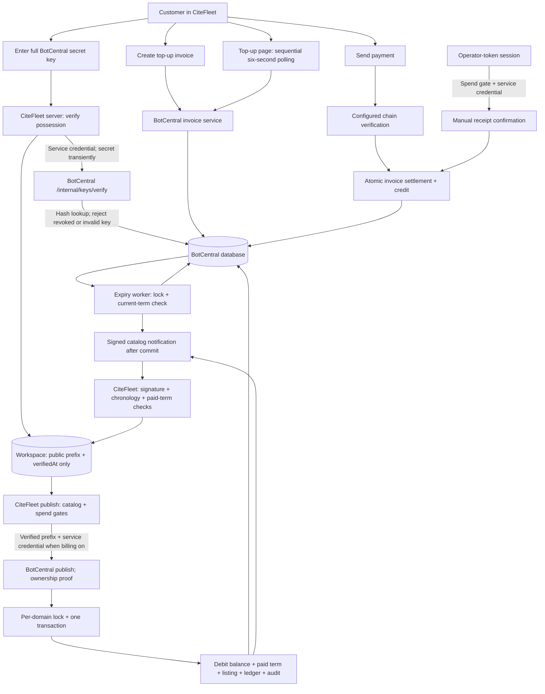

# Billing system and corrective audit

Status: **Built, E2E pending** for live authenticated payment settlement, production webhook delivery and contention across independent PostgreSQL connections. Changes are not deployed.

## System diagram

Manual confirmation trusts an operator's out-of-band receipt check; it does not independently prove an on-chain payment. Chain verification depends on a configured treasury and supported asset. This audit did not verify the production account's configuration. Free catalog reads do not debit balances. In billing-enabled publishing, a current paid term permits edits without a new term debit; a first term or renewal uses the atomic charge path.

## Findings fixed

1. **Critical — customer-accessible manual settlement.** Ordinary account sessions previously reached service-authorized settlement. The server now requires the authenticated operator-token principal before making any provider call. The UI hides manual confirmation for other sessions, but authorization is enforced server-side.
2. **High — public prefix accepted as billing authority.** Full-key possession is checked against BotCentral's existing hashed-key lookup. Only the public prefix and verification timestamp are saved. Invalid and revoked keys fail; billing-enabled publishing rejects missing and legacy unverified keys.
3. **High — monetary operations accepted publisher credentials.** Direct credit, invoice settlement and billed publishing now require the service credential. Publisher access for non-billed publishing retains its existing ownership checks.
4. **High — separate debit and listing writes.** The domain lock, term read, debit, listing, etag, audit and job-ledger write now share a transaction. Forced failures roll back; notification occurs after commit.
5. **Medium — invoice polling loop.** Polling now uses stable invoice identity/status, waits six seconds between requests and stops obsolete in-flight work from scheduling another request.
6. **Medium — stale lapse event.** CiteFleet rejects older catalog events and lapse events for an older paid term inside the workspace mutation.
7. **Medium — expiry/renewal race.** BotCentral expiry processing locks the domain and rechecks the selected paid term before changing verification. A renewal between expiry selection and update survives.

An independent cold review inspected the final billing and authorization paths and reported no unresolved billing finding in the reviewed changes. This is scoped code-review evidence, not a guarantee that the whole product has no defects.

## Executed validation

Node 22.23.2; isolated local checkouts of both repositories.

- CiteFleet `npm test`: **711 tests, 703 passed, 0 failed, 8 skipped**. Skips concern absent gitignored `.grok` template fixtures.
- CiteFleet `npm run typecheck`, `npm run lint`, and `NITRO_PRESET=node-server VITE_AUTH_ENABLED=false npm run build`: passed.
- CiteFleet `E2E_URL=http://127.0.0.1:4188 npx playwright test -c tests/e2e/billing.playwright.config.ts`: **1 passed** in headed Chrome. Executed built page, observed spaced polling and absent anonymous manual-confirmation control. Invoice HTTP responses were stubbed.
- BotCentral `npm test`: scripts **199 tests, 182 passed, 17 failed**; application **212 tests, 209 passed, 0 failed, 3 TODOs**. The unchanged baseline reproduces the identical 17 script failures. TODOs remain in existing publisher ownership tests.
- BotCentral `npm run typecheck` and `NITRO_PRESET=node-server VITE_AUTH_ENABLED=true npm run build`: passed. Build reports DATABASE_URL unset and skips external migration.
- BotCentral `npx eslint src scripts server`: **2 errors, 5 warnings**, all reproduced unchanged on baseline. Errors are `no-empty` in `src/lib/app-data/client.server.ts:214` and `no-useless-escape` in `src/routes/docs.publisher.tsx:17`.
- BotCentral `listing-term-db.test.ts`: **16 passed** against real PGlite, including competing publishes, listing/ledger rollback and expiry/renewal interleaving.
- Cross-repository loopback integration executed the actual CiteFleet key-verification helper through the actual BotCentral HTTP handler and PGlite hashed-key lookup: valid secret accepted, public prefix rejected, secret not persisted. This was a temporary local integration harness.
- Independent review reran CiteFleet's focused 20 tests and BotCentral's focused authorization 6 plus ledger 16 tests; all passed. Both diffs passed `git diff --check`.

Reproductions failed before fixes: customer settlement authorization, competing term debit/rollback, polling and stale event regressions, and renewal between expiry selection and mutation. Tests now pass at the levels described above.

## Release and remaining verification

1. Deploy BotCentral first, including `/internal/keys/verify` and monetary service-only gates.
2. Deploy CiteFleet using the matching service credential. Existing saved prefixes must be reverified with the full key before billed publishing.
3. Verify real customer versus operator sessions, possession rejection, a controlled funded invoice, one initial term purchase, retry without duplicate debit, and renewal under contention against the deployed database. Verify signed webhook delivery and stale lapse rejection end to end.
4. Confirm the provider reports the deployment ready before describing it as shipped.

No production deployment, live payment or production data mutation was performed. PGlite tests execute real SQL but serialize transactions internally; independent-connection PostgreSQL advisory-lock contention remains untested. Local headed browser checks do not establish the authenticated production flow. The existing BotCentral script/lint failures remain outside this billing correction.
